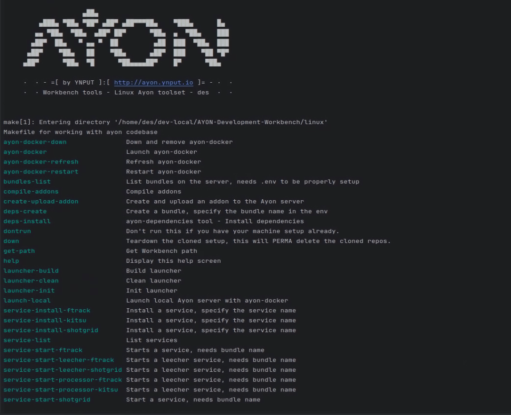

                    ▄██▄
         ▄███▄ ▀██▄ ▀██▀ ▄██▀ ▄██▀▀▀██▄    ▀███▄      █▄
        ▄▄ ▀██▄  ▀██▄  ▄██▀ ██▀      ▀██▄  ▄  ▀██▄    ███
       ▄██▀  ██▄   ▀ ▄▄ ▀  ██         ▄██  ███  ▀██▄  ███
      ▄██▀    ▀██▄   ██    ▀██▄      ▄██▀  ███    ▀██ ▀█▀
     ▄██▀      ▀██▄  ▀█      ▀██▄▄▄▄██▀    █▀      ▀██▄

     ·  · - =[ by YNPUT ]:[ http://ayon.ynput.io ]= - ·  ·
     ·  · Workbench tools - Linux Ayon toolset - des  ·  ·


## Hello dear linux user!

This is a generic linux port of the Development Workbench for Ayon for Linux.

### IMPORTANT!
This is for development purposes only, it is not meant to be used in production. If you do you should be aware that all data can be deleted with a simple make down command, and you will get a reseted and deleted repos.

### Merge request and Colaboration
Please feel free to fork and make a merge request if you have any improvements or suggestions. I will be happy to merge them in.
If you find something non-working or have any suggestions please open an issue and I will try to fix it as soon as possible.
#### I am aware not all commands are implemented to the fullest, if you need those working either ping me or make a PR and I will merge it in.

### What is this?
It will allow you to easily set up a development environment for Ayon on your linux machine.
I have tried to port the setup as close as possible to the original setup for Windows with some slight modifications.
The setup will clone all the necessary repos and set up the environment for you to start developing on Ayon.
The setup will also clone all the addons and set up the environment for you to start developing on the addons.

Tested on Ubuntu 20.04.
Repo assumes you have make and other tools installed on your machine.
Make sure you have docker installed on your machine before running the make commands which uses docker to build the launcher or dependecies.


### TODO:
- [x] Add support for Ubuntu 20.04
- [ ] Copy env file for the running commands
- [ ] Add support for other linux distributions
- [ ] Add support for custom / private repos
- [ ] Add one-click build / deploy for Ayon server
- [ ] Add one-click build / deploy for Ayon addons


### Installation

Clone the repo and run make

### Help





Available commands are:

```shell

Running make will show you the help file like so:

Makefile for working with ayon codebase
ayon-docker-down               Down and remove ayon-docker
ayon-docker                    Launch ayon-docker
ayon-docker-refresh            Refresh ayon-docker
ayon-docker-restart            Restart ayon-docker
bundles-list                   List bundles on the server, needs .env to be properly setup
compile-addons                 Compile addons
create-upload-addon            Create and upload an addon to the Ayon server
deps-create                    Create a bundle, specify the bundle name in the env
deps-install                   ayon-dependencies tool - Install dependencies
dontrun                        Do not run this if you have your machine setup already.
down                           Teardown the cloned setup, this will PERMA delete the cloned repos.
get-path                       Get Workbench path
help                           Display this help screen
launcher-build                 Build launcher
launcher-clean                 Clean launcher
launcher-init                  Init launcher
launch-local                   Launch local Ayon server with ayon-docker
service-install-ftrack         Install a service, specify the service name
service-install-kitsu          Install a service, specify the service name
service-install-shotgrid       Install a service, specify the service name
service-list                   List services
service-start-ftrack           Starts a service, needs bundle name
service-start-leecher-ftrack   Starts a leecher service, needs bundle name
service-start-leecher-shotgrid Starts a leecher service, needs bundle name
service-start-processor-ftrack Starts a leecher service, needs bundle name
service-start-processor-kitsu  Starts a leecher service, needs bundle name
service-start-shotgrid         Start a service, needs bundle name
set-bundle-name                Set bundle name
set-env                        Set environment variables - server apikey, server url
setup-clean                    Clean the cloned setup, this will PERMA delete the cloned repos.
setup-clone-addons             Clone all addons
setup-clone                    Clone ALL repos (both server and addons)
setup-clone-core               Clone all core repos
setup                          Welcome message
show-env                       Show environment variables in the Makefile and the shell
test                           Run test - repos clone and remove, no compile.
update-addons                  Update all addons pull
update-ayon-core-env           Update ayon core environment
update-core                    Update core pull

```
